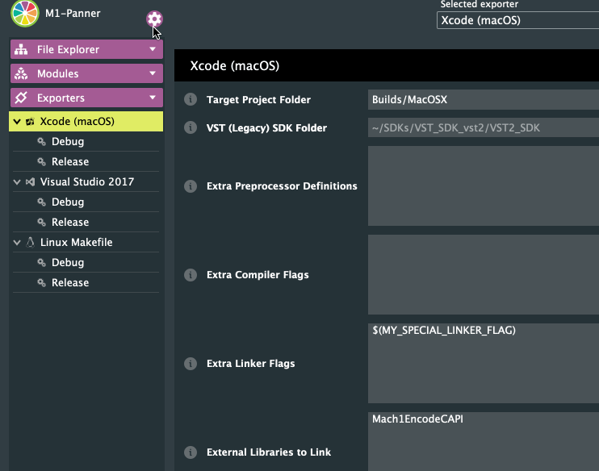

# m1-panner
GUI and plugin concept for Mach1Encode API

## Modes
The M1-Panner can be compiled into two "modes"
 1. *Multichannel Internal Spatial Audio Processing*: The spatial audio is processed within the M1-Panner instance internally but is only supported in plugin hosts that support multichannel input/output
 	- Multichannel Internal Processing: `CUSTOM_CHANNEL_LAYOUT`: This mode is for plugin hosts that do not support changing the input/output bussing to the plugin after it has already been instantiated.
 	- Multichannel Internal Processing: `DYNAMIC_IO_PLUGIN_MODE`: This mode is for plugin hosts that can handle changing the input/output bussing and exposes the parameters/UI for managing changing the input/output layouts of the plugin
 2. *Streaming External Spatial Audio Processing*: The spatial audio is processed externally and the M1-Panner is compiled with the needed parameters/UI for indicating to the external processor what the expected I/O is, this is intended for plugin hosts that only support up to stereo audio I/O for plugins.
 	- Streaming External Processing: `STREAMING_PANNER_PLUGIN`: This is the preprocessor definition needed to activate this mode

## Compiler Options

### `STREAMING_PANNER_PLUGIN`

#### CMake
- Add as a preprocess definition via `-DSTREAMING_PANNER_PLUGIN`

#### JUCE
- Add `STREAMING_PANNER_PLUGIN` in the .jucer's Exporters->[Target]->Extra Preprocessor Definitions

### `CUSTOM_CHANNEL_LAYOUT`

##### CMake
- Add as a preprocess definition via `-DCUSTOM_CHANNEL_LAYOUT` and also define the `INPUTS` and `OUTPUTS`

Example:
`-DCUSTOM_CHANNEL_LAYOUT -DINPUTS=1 -DOUTPUTS=8`

### `CUSTOM_CHANNEL_LAYOUT_BY_HOST`
_This should not be set manually, this is determined for specific CUSTOM_CHANNEL_LAYOUT requirements on DAWs like AAX or RTAS_

##### JUCE
- Defining the `Plugin Channel Configuration` into the .jucer will automatically define the `CUSTOM_CHANNEL_LAYOUT` definition

### `DYNAMIC_IO_PLUGIN_MODE`
This is for plugin hosts that can support re-initializing the input/output bussing and exposing the I/O UI for users to take advantage of this. This should not be set manually in most cases.

### `ITD_PARAMETERS`
Enables the Interaural Time Difference processing parameters for the M1-Panner for simulating creative headshadowing effects while panning.

#### CMake
- Add as a preprocess definition via `-DITD_PARAMETERS`

#### JUCE
- Add `ITD_PARAMETERS` in the .jucer's Exporters->[Target]->Extra Preprocessor Definitions
